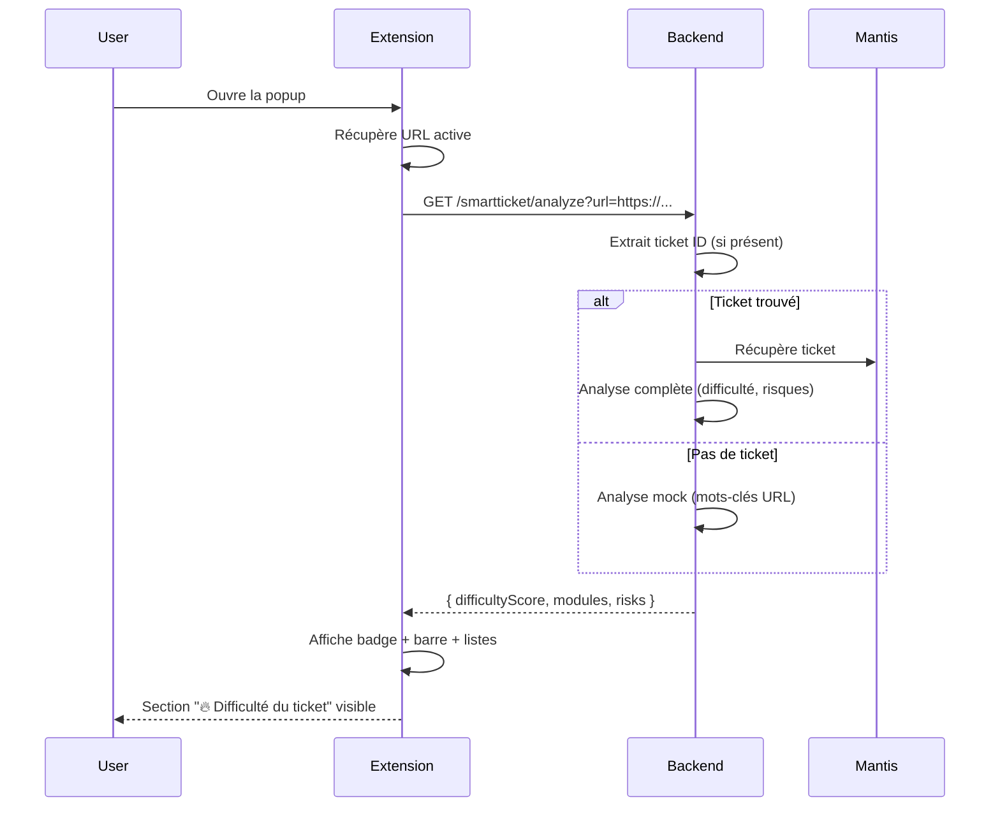

# 🎟️ SmartTicket - Intégration dans SmartContext Doc

## ✅ Ce qui a été ajouté

### 1. Frontend (Extension Chrome)

**Fichier : `extension/popup.html`**
- ✅ Nouvelle section `difficultySection` avec :
  - Badge de difficulté coloré
  - Score numérique
  - Barre de 5 segments
  - Liste des modules impactés
  - Liste des risques détectés

**Fichier : `extension/popup.css`**
- ✅ Styles pour le badge de difficulté :
  - `.difficulty-low` (vert) : score 1-2
  - `.difficulty-medium` (orange) : score 3
  - `.difficulty-high` (rouge) : score 4-5
- ✅ Barre de progression avec 5 segments animés
- ✅ Badges de modules (bleu)
- ✅ Liste de risques (rouge)

**Fichier : `extension/popup.js`**
- ✅ Fonction `loadTicketDifficulty(url)` : Appel API automatique
- ✅ Fonction `displayTicketDifficulty(data)` : Affichage des données
- ✅ Fonction `updateDifficultyBadge(score)` : Couleur du badge
- ✅ Fonction `updateDifficultyBar(score)` : Remplissage de la barre
- ✅ Fonction `updateModulesList(modules)` : Liste des modules
- ✅ Fonction `updateRisksList(risks)` : Liste des risques

### 2. Backend (API)

**Fichier : `server/smartticket/routes/smartticket.routes.js`**
- ✅ Nouvel endpoint : `GET /smartticket/analyze?url=<URL>`
- ✅ Extraction automatique de l'ID du ticket depuis l'URL
- ✅ Analyse complète via SmartTicketService si ticket trouvé
- ✅ Analyse mock basée sur mots-clés si pas de ticket
- ✅ Format de réponse : `{ difficultyScore, modules, risks }`

---

## 🚀 Comment ça fonctionne

### Flux complet



### Exemple de réponse API

```json
{
  "difficultyScore": 4.0,
  "modules": ["Absence", "Planning"],
  "risks": [
    "Cross-module",
    "Scénario manquant",
    "Risque d'intégrité des données"
  ]
}
```

---

## 🧪 Tests

### Test 1 : URL avec mot-clé "error"

1. **Ouvrir une page** : `https://example.com/ticket/error-12345`
2. **Ouvrir la popup** SmartContext Doc
3. **Résultat attendu** :
   - Section "🔥 Difficulté du ticket" **visible**
   - Badge **orange ou rouge** (score augmenté par "error")
   - Barre remplie à 3-4 segments
   - Modules : "Général" (ou autres détectés)
   - Risques : "Scénario manquant" (ou autres)

### Test 2 : URL Mantis réelle

1. **Prérequis** : Serveur backend démarré
2. **URL** : `https://mantis.example.com/view.php?id=12345`
3. **Ouvrir la popup**
4. **Résultat attendu** :
   - Appel à `analyzeTicket("12345", "mantis")`
   - Analyse complète depuis SmartTicketService
   - Badge coloré selon score réel (1-5)
   - Modules extraits des dependencies
   - Risques réels depuis RiskAnalyzer

### Test 3 : URL sans ticket

1. **URL** : `https://google.com`
2. **Ouvrir la popup**
3. **Résultat attendu** :
   - Analyse mock générique
   - Score par défaut : 2.0 (badge **vert**)
   - Modules : "Général"
   - Risques : "Scénario manquant"

### Test 4 : URL avec mots-clés multiples

1. **URL** : `https://example.com/production-multi-absence-critical`
2. **Ouvrir la popup**
3. **Résultat attendu** :
   - Score augmenté (mots-clés détectés)
   - Badge **rouge** (score ≥ 4)
   - Barre remplie à 4-5 segments
   - Modules : "Absence" détecté
   - Risques : "Impact production", "Plusieurs composants affectés"

---

## 📊 Comportement du badge

| Score | Couleur | Classe CSS | Emoji | Texte |
|-------|---------|------------|-------|-------|
| 1.0 - 2.9 | 🟢 Vert | `difficulty-low` | ✓ | "Difficulté : Faible ✓" |
| 3.0 - 3.9 | 🟠 Orange | `difficulty-medium` | ⚠️ | "Difficulté : Moyenne ⚠️" |
| 4.0 - 5.0 | 🔴 Rouge | `difficulty-high` | 🔥 | "Difficulté : Élevée 🔥" |

---

## 🎨 Aperçu visuel

```
┌─────────────────────────────────────────┐
│ 📚 SmartContext Doc                     │
│ https://mantis.example.com/view.php?... │
├─────────────────────────────────────────┤
│ 📖 Documentation                        │
│ [Documentation Mantis trouvée]          │
├─────────────────────────────────────────┤
│ 🤖 Résumé IA                            │
│ [Résumé de la doc...]                   │
├─────────────────────────────────────────┤
│ 🔥 Difficulté du ticket                 │
│                                         │
│ [Difficulté : Élevée 🔥]     [4.0]     │
│                                         │
│ ████████████████████░ (4/5 segments)    │
│                                         │
│ 🔧 Modules impactés                     │
│ [Absence] [Planning]                    │
│                                         │
│ ⚠️ Risques détectés                     │
│ ⚠️ Cross-module                         │
│ ⚠️ Scénario manquant                    │
│ ⚠️ Risque d'intégrité des données       │
└─────────────────────────────────────────┘
```

---

## 🔧 Configuration

### Modifier le seuil des couleurs

**Fichier : `extension/popup.js`**, fonction `updateDifficultyBadge(score)`

```javascript
// Changer les seuils ici :
if (score >= 1 && score < 3) {
  level = 'Faible';      // Vert
  className = 'difficulty-low';
} else if (score >= 3 && score < 4) {
  level = 'Moyenne';     // Orange
  className = 'difficulty-medium';
} else if (score >= 4 && score <= 5) {
  level = 'Élevée';      // Rouge
  className = 'difficulty-high';
}
```

### Ajouter des mots-clés de détection

**Fichier : `server/smartticket/routes/smartticket.routes.js`**, fonction `generateMockAnalysis(url)`

```javascript
// Ajouter des mots-clés pour augmenter le score
const complexKeywords = [
  'error', 'crash', 'bug', 'critical', 'urgent',
  'regression', 'multi',
  'NOUVEAU_MOT_CLE_ICI'  // ← Ajouter ici
];

// Ajouter des modules détectables
const moduleKeywords = {
  'absence': 'Absence',
  'planning': 'Planning',
  'paie': 'Paie',
  'nouveau_module': 'Nouveau Module'  // ← Ajouter ici
};
```

---

## 🐛 Débogage

### Console de la popup

**Ouvrir** : Clic droit sur icône extension → Inspecter

**Logs à vérifier** :
```
[SmartTicket] Chargement analyse difficulté pour: https://...
[SmartTicket] Données reçues: { difficultyScore: 4, modules: [...], risks: [...] }
[SmartTicket] Barre mise à jour: 4/5 segments actifs
[SmartTicket] 2 module(s) affiché(s)
[SmartTicket] 3 risque(s) affiché(s)
```

### Console du serveur

**Logs à vérifier** :
```
[API] Analyse difficulté pour URL: https://mantis.example.com/view.php?id=12345
[SmartTicket] Analyse ticket #12345 depuis mantis
[API] Récupération du dernier résultat: ticket #12345
```

### Problèmes courants

#### ❌ Section non affichée

**Causes possibles** :
1. Serveur backend non démarré
2. CORS bloqué (vérifier `server.js`)
3. URL incompatible (chrome://, about:blank)

**Solution** :
```bash
# Vérifier serveur
curl http://localhost:8787/smartticket/health

# Tester endpoint
curl "http://localhost:8787/smartticket/analyze?url=https://example.com/ticket/123"
```

#### ❌ Badge ne change pas de couleur

**Cause** : Classe CSS non appliquée

**Solution** : Vérifier dans l'inspecteur que la classe `difficulty-low`, `difficulty-medium`, ou `difficulty-high` est bien présente sur l'élément `.difficulty-badge`.

#### ❌ Barre ne se remplit pas

**Cause** : Segments non activés

**Solution** : Vérifier dans la console que `updateDifficultyBar(score)` est bien appelé et que les segments ont la classe `.active`.

---

## 📝 Script de test complet

**Fichier : `test-smartticket-integration.bat`**

```batch
@echo off
echo ==========================================
echo Test SmartTicket Integration
echo ==========================================
echo.

REM 1. Health check
echo 1. Health check...
curl -s http://localhost:8787/smartticket/health
echo.
echo.

REM 2. Test avec URL générique
echo 2. Test URL generique (error keyword)...
curl -s "http://localhost:8787/smartticket/analyze?url=https://example.com/error-123"
echo.
echo.

REM 3. Test avec URL Mantis mock
echo 3. Test URL Mantis (mock)...
curl -s "http://localhost:8787/smartticket/analyze?url=https://mantis.example.com/view.php?id=12345"
echo.
echo.

REM 4. Test avec URL multi-keywords
echo 4. Test URL multi-keywords...
curl -s "http://localhost:8787/smartticket/analyze?url=https://example.com/production-multi-absence-critical"
echo.
echo.

echo ==========================================
echo Tests termines !
echo Ouvrez maintenant l'extension Chrome sur ces URLs de test
echo ==========================================
pause
```

---

## ✅ Checklist de vérification

- [ ] Serveur démarré (`npm run dev`)
- [ ] Extension rechargée dans Chrome
- [ ] Test URL avec mot-clé "error" → Badge orange/rouge
- [ ] Test URL sans mot-clé → Badge vert
- [ ] Barre de 5 segments se remplit correctement
- [ ] Modules affichés en badges bleus
- [ ] Risques affichés en liste rouge
- [ ] Section masquée sur pages chrome:// et about:blank
- [ ] Logs dans console popup et serveur

---

## 🎉 Résumé

Tu as maintenant une **intégration complète de SmartTicket dans SmartContext Doc** :

1. ✅ **Section visible automatiquement** quand une analyse est disponible
2. ✅ **Badge coloré dynamique** selon le score (vert → orange → rouge)
3. ✅ **Barre de 5 segments animée** qui se remplit proportionnellement
4. ✅ **Modules impactés** affichés en badges bleus
5. ✅ **Risques détectés** listés avec icônes d'avertissement
6. ✅ **Compatible avec l'existant** : n'interfère pas avec les autres sections

**Version** : 1.0.0
**Date** : 2026-02-10
**Auteur** : Claude Sonnet 4.5
