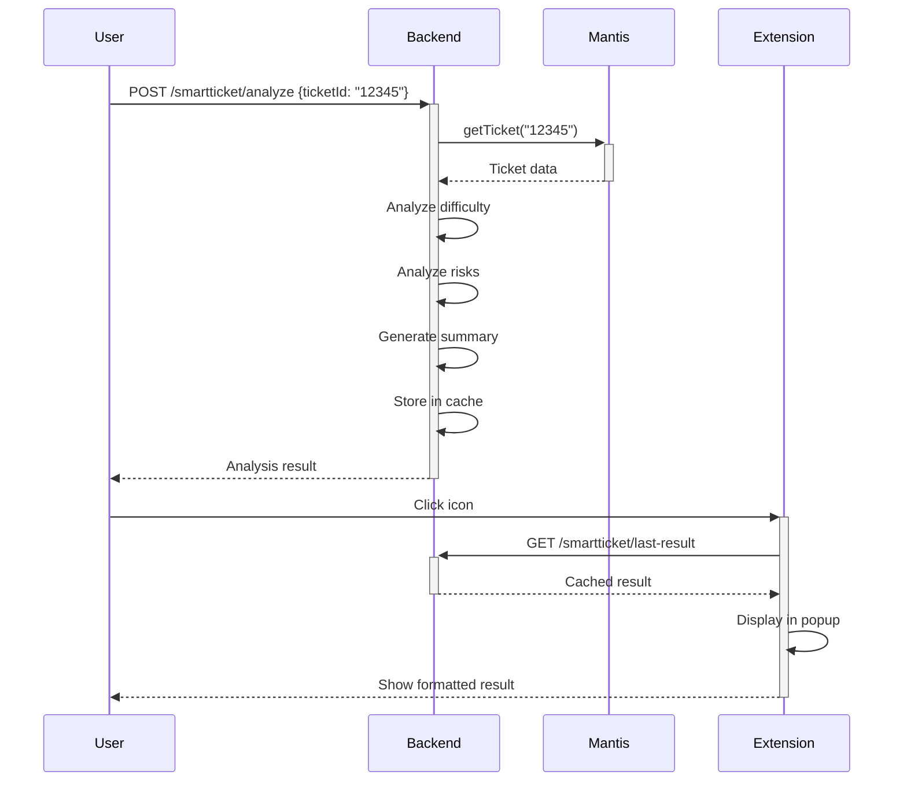

# 🎟️ SmartTicket - Guide d'Installation

## 📦 Ce qui a été créé

### Backend (Server)
- ✅ **GET /smartticket/last-result** - Endpoint pour récupérer le dernier ticket analysé
- ✅ Cache en mémoire du dernier résultat d'analyse

### Extension Chrome
- ✅ **manifest.json** - Configuration de l'extension
- ✅ **popup.html** - Interface utilisateur (structure)
- ✅ **popup.css** - Styles professionnels avec badges colorés
- ✅ **popup.js** - Logique de récupération et affichage des données
- ✅ **README.md** - Documentation complète
- ✅ **INSTALLATION.md** - Ce guide

---

## 🚀 Installation en 3 étapes

### Étape 1 : Démarrer le serveur backend

```bash
cd C:\Users\FATIH\Desktop\PnetCrew\server
npm run dev
```

Vérifier que le serveur est actif :
```bash
curl http://localhost:8787/smartticket/health
```

### Étape 2 : Charger l'extension Chrome

1. **Ouvrir Chrome** et aller à : `chrome://extensions`
2. **Activer le "Mode développeur"** (toggle en haut à droite)
3. **Cliquer sur "Charger l'extension non empaquetée"**
4. **Naviguer vers** : `C:\Users\FATIH\Desktop\PnetCrew\extension\smartticket`
5. **Sélectionner le dossier** et cliquer sur "Sélectionner"

✅ L'extension "SmartTicket - Analyse de Tickets" devrait maintenant apparaître dans la liste.

### Étape 3 : Tester le système complet

#### Option A : Via script (Windows)

```bash
cd C:\Users\FATIH\Desktop\PnetCrew\server\smartticket
test-popup.bat
```

#### Option B : Manuellement avec curl

1. **Analyser un ticket** (utilise les données mock) :
```bash
curl -X POST http://localhost:8787/smartticket/analyze \
  -H "Content-Type: application/json" \
  -d "{\"ticketId\": \"12345\", \"source\": \"mantis\"}"
```

2. **Vérifier le cache** :
```bash
curl http://localhost:8787/smartticket/last-result
```

3. **Ouvrir la popup** :
   - Cliquer sur l'icône de l'extension SmartTicket dans Chrome
   - La popup affiche automatiquement le dernier ticket analysé

---

## 📊 Résultat attendu

La popup affiche :

```
╔═══════════════════════════════════════╗
║   🎟️ SmartTicket                     ║
╠═══════════════════════════════════════╣
║ #12345                                ║
║ Incohérence calcul absence multi-     ║
║ contrats                              ║
╠═══════════════════════════════════════╣
║ 📊 Difficulté                         ║
║                                       ║
║ [CRITIQUE] 4.5                        ║
║ ████████████████░░                    ║
╠═══════════════════════════════════════╣
║ 🔧 Modules Impactés                   ║
║ [Absence] [Paie]                      ║
╠═══════════════════════════════════════╣
║ ⚠️ Risques Détectés                   ║
║ • Risque d'intégrité des données      ║
║ • Plusieurs clients affectés          ║
╠═══════════════════════════════════════╣
║ 🤖 Résumé IA                          ║
║ Le calcul des absences ne fonctionne  ║
║ pas correctement pour les salariés    ║
║ ayant plusieurs contrats simultanés.  ║
║ ...                                   ║
╠═══════════════════════════════════════╣
║ Priorité: urgent | Statut: assigned   ║
║ Âge: 5 jours                          ║
╚═══════════════════════════════════════╝
```

---

## 🎨 Codes couleur des badges

| Niveau | Score | Couleur | Badge |
|--------|-------|---------|-------|
| **Faible** | 1.0-1.5 | 🟢 Vert | `FAIBLE` |
| **Moyen** | 1.5-2.5 | 🟡 Jaune | `MOYEN` |
| **Élevé** | 2.5-3.5 | 🟠 Orange | `ÉLEVÉ` |
| **Très Élevé** | 3.5-4.5 | 🔴 Rouge | `TRÈS ÉLEVÉ` |
| **Critique** | 4.5-5.0 | 🔴 Rouge foncé | `CRITIQUE` |

---

## 🔧 Configuration avancée

### Changer l'URL de l'API

Par défaut, la popup appelle `http://localhost:8787/smartticket/last-result`.

Pour changer l'URL :

1. Éditer `popup.js`, ligne 7 :
```javascript
const API_URL = 'http://votre-serveur:8787/smartticket/last-result';
```

2. Mettre à jour `manifest.json` pour autoriser le nouveau domaine :
```json
"host_permissions": [
  "http://votre-serveur:8787/*"
]
```

3. Recharger l'extension dans Chrome

### Personnaliser les styles

Éditer `popup.css` pour modifier :
- Couleurs des badges (`.difficulty-badge.*`)
- Hauteur de la barre (`.difficulty-bar`)
- Police et tailles de texte
- Bordures et ombres

---

## 🐛 Dépannage

### ❌ "Aucune analyse disponible"

**Problème** : L'endpoint `/last-result` retourne 404.

**Solution** :
1. Vérifier que le serveur est démarré
2. Analyser au moins un ticket avec `POST /analyze`

### ❌ "Failed to fetch"

**Problème** : La popup ne peut pas se connecter au serveur.

**Solutions** :
1. Vérifier que le serveur est actif : `curl http://localhost:8787/health`
2. Vérifier les permissions CORS dans `server.js`
3. Vérifier les `host_permissions` dans `manifest.json`

### ❌ "Erreur HTTP 500"

**Problème** : Le serveur rencontre une erreur interne.

**Solutions** :
1. Vérifier les logs du serveur
2. Vérifier la configuration Mantis/PMTalk dans `.env`
3. En développement, vérifier que `NODE_ENV=development` est défini

### ❌ L'extension ne s'affiche pas

**Problème** : L'icône de l'extension n'apparaît pas dans Chrome.

**Solutions** :
1. Vérifier que l'extension est bien chargée dans `chrome://extensions`
2. Vérifier que "Mode développeur" est activé
3. Essayer de recharger l'extension (icône de rechargement)
4. Vérifier les chemins des icônes dans `manifest.json`

---

## 📝 Workflow complet

### Scénario 1 : Analyse manuelle d'un ticket



### Scénario 2 : Scan automatique de tous les tickets

```bash
# 1. Scanner tous les tickets ouverts
curl http://localhost:8787/smartticket/scan-all?limit=10

# 2. Les résultats sont triés par difficulté décroissante
# 3. Le dernier ticket analysé est dans le cache
# 4. Ouvrir la popup pour voir le résultat
```

---

## ✅ Checklist de vérification

- [ ] Serveur démarré (`npm run dev`)
- [ ] Health check OK (`curl http://localhost:8787/smartticket/health`)
- [ ] Extension chargée dans Chrome (`chrome://extensions`)
- [ ] Mode développeur activé
- [ ] Au moins un ticket analysé (`POST /analyze`)
- [ ] Cache vérifié (`GET /last-result`)
- [ ] Popup affiche les données correctement
- [ ] Badge de difficulté coloré
- [ ] Barre de 5 segments remplie
- [ ] Modules affichés
- [ ] Risques listés
- [ ] Résumé formaté

---

## 🎉 Félicitations !

Votre extension SmartTicket est maintenant opérationnelle ! 🚀

Pour plus d'informations, consulter :
- `README.md` - Documentation complète
- `server/smartticket/README.md` - Documentation du backend
- `server/smartticket/examples/` - Exemples de réponses API

**Version** : 1.0.0
**Date** : 2026-02-10
**Auteur** : Claude Sonnet 4.5
