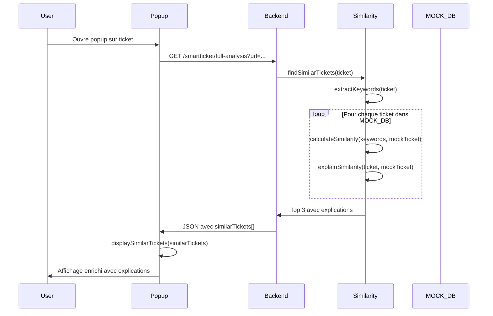

# 🔍 Tickets Similaires - Explications Intelligentes (V3.1)

## 📋 Vue d'ensemble

Le système de tickets similaires a été amélioré avec des **explications intelligentes automatiques** qui détaillent **pourquoi** deux tickets sont considérés comme similaires.

---

## 🎯 Fonctionnalités

### 1️⃣ Détection automatique de similarité

Le pipeline V3.0 inclut l'étape 4 qui :
- Extrait les embeddings du ticket actuel
- Compare avec la base vectorielle (8 tickets mock)
- Retourne les 3 meilleurs matches avec score > 0.3

### 2️⃣ Explication intelligente

Pour chaque ticket similaire, le système analyse :

| Critère | Description | Exemple |
|---------|-------------|---------|
| **Modules communs** | Modules fonctionnels partagés | `Absence, Planning` |
| **Termes communs** | Mots-clés identiques | `'calcul', 'multi-contrats'` |
| **Catégorie** | Catégorie identique | `Absence` |
| **Anomalies similaires** | Risk words communs | `incohérence, régression` |
| **Pattern fonctionnel** | Problème comparable | `Recalcul Absence/Planning` |

### 3️⃣ Affichage enrichi

Chaque ticket similaire affiche :
- **ID cliquable** → Lien vers Mantis (`https://mantis-pd.cegid.fr/mantis-client/view.php?id={id}`)
- **Badge de similarité** → 🔴 Rouge (>70%), 🟠 Orange (50-70%), 🔵 Bleu (<50%)
- **Titre** du ticket similaire
- **Explication** → Raisons de la similarité en texte clair

---

## 🔌 API Backend

### Route : `GET /smartticket/fetch-ticket`

**Usage :**
```bash
GET /smartticket/fetch-ticket?id=111525
```

**Réponse :**
```json
{
  "id": "111525",
  "title": "Incohérence calcul absence multi-contrats",
  "description": "Le calcul des absences ne fonctionne pas correctement...",
  "summary": "Calcul incorrect des absences en cas de multi-contrats",
  "category": "Absence",
  "modules": ["Absence", "Contrat", "Planning"],
  "keywords": ["absence", "multi-contrats", "incohérence", "calcul"],
  "riskWords": ["incohérence", "calcul incorrect", "multi-contrats"]
}
```

### Fonction : `explainSimilarity(baseTicket, similarTicket)`

**Localisation :** `server/smartticket/analyzers/similarity.js`

**Paramètres :**
- `baseTicket` : Ticket de référence (actuel)
- `similarTicket` : Ticket à comparer

**Retour :**
```json
{
  "reasons": [
    "Modules communs : Absence, Contrat",
    "Termes communs : 'absence', 'multi-contrats', 'calcul'",
    "Catégorie identique : Absence",
    "Anomalies similaires : incohérence, calcul incorrect",
    "Problème fonctionnel comparable : Gestion multi-contrats"
  ],
  "text": "Modules communs : Absence, Contrat • Termes communs : 'absence', 'multi-contrats', 'calcul' • ..."
}
```

**Algorithme :**

1. **Modules communs** : Détecte les modules fonctionnels via patterns regex
2. **Mots-clés communs** : Compare les keywords extraits (stopwords filtrés)
3. **Catégorie** : Vérifie si baseTicket.category === similarTicket.category
4. **Risk words** : Détecte les mots de risque (incohérence, régression, blocage...)
5. **Pattern fonctionnel** : Identifie des patterns métier (ex: "Recalcul Absence/Planning")

---

## 🎨 Rendu visuel dans la popup

### Exemple de section "Tickets similaires"

```
┌─────────────────────────────────────────────────────────┐
│ 🔍 Tickets similaires                                   │
├─────────────────────────────────────────────────────────┤
│ ┌─────────────────────────────────────────────────────┐ │
│ │ #111525                            🔴 92%           │ │
│ │ Incohérence calcul absence multi-contrats          │ │
│ │ ┌───────────────────────────────────────────────┐  │ │
│ │ │ 💡 Modules communs : Absence, Contrat •       │  │ │
│ │ │    Termes communs : 'absence', 'multi-        │  │ │
│ │ │    contrats', 'calcul' • Catégorie            │  │ │
│ │ │    identique : Absence • Anomalies            │  │ │
│ │ │    similaires : incohérence, calcul incorrect │  │ │
│ │ │    • Problème fonctionnel comparable :        │  │ │
│ │ │    Gestion multi-contrats                     │  │ │
│ │ └───────────────────────────────────────────────┘  │ │
│ └─────────────────────────────────────────────────────┘ │
│                                                         │
│ ┌─────────────────────────────────────────────────────┐ │
│ │ #112020                            🟠 88%           │ │
│ │ Incohérence calcul absence pour multi-contrats     │ │
│ │ ┌───────────────────────────────────────────────┐  │ │
│ │ │ 💡 Modules communs : Absence, Contrat •       │  │ │
│ │ │    Termes communs : 'absence', 'multi-        │  │ │
│ │ │    contrats', 'calcul' • Catégorie            │  │ │
│ │ │    identique : Absence • Anomalies            │  │ │
│ │ │    similaires : incohérence, double           │  │ │
│ │ │    comptabilisation                           │  │ │
│ │ └───────────────────────────────────────────────┘  │ │
│ └─────────────────────────────────────────────────────┘ │
│                                                         │
│ ┌─────────────────────────────────────────────────────┐ │
│ │ #110452                            🔵 67%           │ │
│ │ Erreur calcul planning après modification absence  │ │
│ │ ┌───────────────────────────────────────────────┐  │ │
│ │ │ 💡 Modules communs : Planning, Absence •      │  │ │
│ │ │    Termes communs : 'planning', 'absence',    │  │ │
│ │ │    'calcul' • Problème fonctionnel comparable │  │ │
│ │ │    : Recalcul Absence/Planning                │  │ │
│ │ └───────────────────────────────────────────────┘  │ │
│ └─────────────────────────────────────────────────────┘ │
└─────────────────────────────────────────────────────────┘
```

### Couleurs et badges

| Score | Badge | Couleur | Icon |
|-------|-------|---------|------|
| ≥ 70% | High | Rouge (#ef4444) | 🔴 |
| 50-69% | Medium | Orange (#f59e0b) | 🟠 |
| < 50% | Low | Bleu (#3b82f6) | 🔵 |

---

## 🔄 Flow automatique

### Séquence complète (100% automatique)



**Points clés :**
- ✅ Aucune action utilisateur nécessaire
- ✅ Pas de fetch supplémentaire côté frontend
- ✅ Les explications sont générées automatiquement dans `findSimilarTickets()`
- ✅ Les URLs Mantis sont reconstituées côté frontend

---

## 📦 Fichiers modifiés

### Backend

1. **`server/smartticket/routes/smartticket.routes.js`**
   - Nouvelle route : `GET /smartticket/fetch-ticket`

2. **`server/smartticket/analyzers/similarity.js`**
   - Fonction : `fetchTicketDetails(id)`
   - Fonction : `explainSimilarity(baseTicket, similarTicket)`
   - Fonction : `detectModules(ticket)`
   - Fonction : `extractRiskWords(ticket)`
   - Fonction : `detectFunctionalPattern(ticket)`
   - Base enrichie : `MOCK_TICKETS_DB` avec modules, keywords, riskWords

### Frontend

3. **`extension/popup.js`**
   - Fonction mise à jour : `displaySimilarTickets(similarTickets)`
   - Génération URL Mantis : `https://mantis-pd.cegid.fr/mantis-client/view.php?id={id}`
   - Affichage badges colorés selon score
   - Affichage explications intelligentes

4. **`extension/popup.css`**
   - Classes : `.similar-ticket-item`, `.similar-header`, `.ticket-link`
   - Classes : `.similarity-badge`, `.similarity-high`, `.similarity-medium`, `.similarity-low`
   - Classes : `.similar-title`, `.similar-explanation`

---

## 🧪 Test manuel

### Démarrer le serveur

```bash
cd server
npm run dev
```

### Tester avec curl

```bash
# Récupérer les détails d'un ticket
curl http://localhost:8787/smartticket/fetch-ticket?id=111525

# Analyse complète avec similarités
curl "http://localhost:8787/smartticket/full-analysis?url=https://mantis.example.com/view.php?id=TEST-002"
```

### Tester dans l'extension

1. Recharger l'extension : `chrome://extensions`
2. Naviguer vers : `https://mantis.example.com/view.php?id=TEST-002`
3. Ouvrir la popup
4. Vérifier la section "🔍 Tickets similaires" en bas
5. Cliquer sur un ID → Ouvre Mantis dans un nouvel onglet

---

## ✅ Validation

### Checklist

- [ ] Route `/smartticket/fetch-ticket` retourne les détails
- [ ] Fonction `explainSimilarity()` génère des raisons pertinentes
- [ ] Pipeline inclut les explications dans `similarTickets[]`
- [ ] Popup affiche les tickets avec badges colorés
- [ ] Liens Mantis sont cliquables et corrects
- [ ] Explications sont lisibles et compréhensibles
- [ ] Hover sur ticket similaire → animation

---

## 📊 Exemple JSON complet

Voir : `server/smartticket/examples/similarity-explanation-example.json`

---

## 🚀 Améliorations futures

- [ ] Fetch réel depuis API Mantis (remplacer MOCK_DB)
- [ ] Embeddings vectoriels avec Azure OpenAI
- [ ] IndexedDB pour cache local des tickets
- [ ] Click sur ticket → Charger détails dans popup
- [ ] Export PDF incluant tickets similaires
- [ ] Historique des tickets consultés

---

**Auteur** : Claude Sonnet 4.5
**Version** : 3.1.0
**Date** : 2026-02-10
